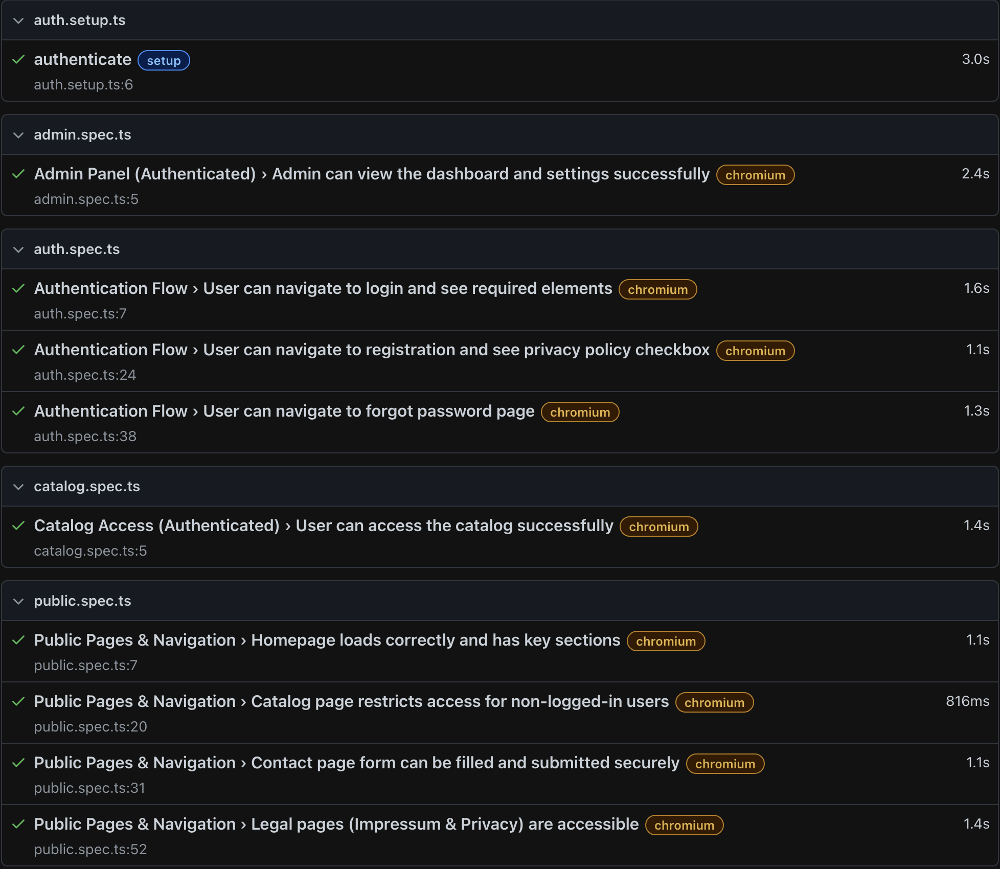

# Rosalix E2E Automation Suite (Playwright)

This repository demonstrates a modular End-to-End (E2E) testing framework built for a responsive B2B FMCG distribution platform. The core application (Rosalix) is proprietary and hosted privately. 

## 🛠️ Key Features Tested
- **Secure Authentication**: Login, Registration (w/ Consent), and Password Recovery.
- **Access Control**: Ensuring protected B2B areas (Catalog/Admin) require valid sessions.
- **Frontend Quality**: Verifying hero sections, navigation, and contact forms.
- **State Management**: Automated login and session persistence (`storageState`).




## 📂 Repository Structure
```
📦 rosalix-qa-automation
 ┣ 📂 .github/workflows
 ┃ ┗ 📜 playwright.yml    # CI/CD Pipeline Configuration
 ┣ 📂 assets
 ┃ ┗ 📜 success.png       # Result Screenshot (Make sure it's success.png)
 ┣ 📂 tests
 ┃ ┣ 📜 auth.setup.ts     # Global Auth State Management
 ┃ ┣ 📜 auth.spec.ts      # Authentication Workflows
 ┃ ┣ 📜 catalog.spec.ts   # Protected Catalog Access
 ┃ ┣ 📜 admin.spec.ts     # Admin Dashboard Verification
 ┃ ┗ 📜 public.spec.ts    # Public Navigation & Forms
 ┣ 📜 playwright.config.ts # Environment & Browser Config
 ┗ 📜 README.md            # Documentation
         
